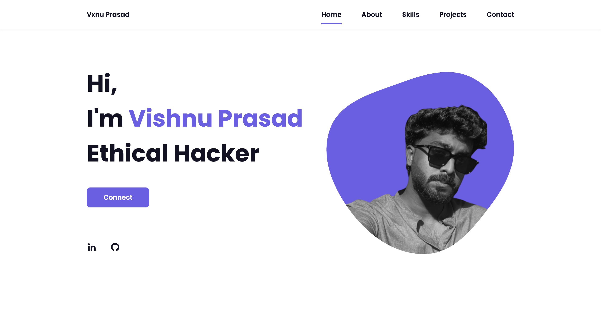

# PORTFLIO_Pro

Portfolio Pro is a sleek and responsive portfolio website developed using HTML, CSS, and JavaScript. This site is designed to showcase personal projects, professional experience, and technical skills in a visually appealing manner.

## Key sections

- **Home**: A welcoming landing page with an engaging introduction and professional tagline..
- **About**: A section detailing personal background, education, and technical expertise.
- **Projects**: A dedicated space to highlight individual projects with descriptions, screenshots, and live demo links, showcasing practical skills in development and cybersecurity.
- **Skills**: A detailed list of programming languages, frameworks, and tools like Python, Django, Ethical Hacking, and Penetration Testing, using interactive progress bars for an appealing user experience.
- **Contact**: A functional contact form where visitors can get in touch, integrated with email services for real-time communication.

  This portfolio site also features smooth scrolling, animated transitions, and is fully optimized for all devices. Additionally, it includes a privacy notice and ethical disclaimer on project sections involving security tools to ensure responsible usage.

#

## Contributions

If you find this tool useful, consider following [techno-rabit](https://github.com/techno-rabit) on GitHub!

## Find Me on:

